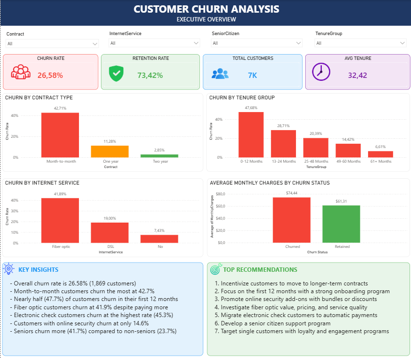
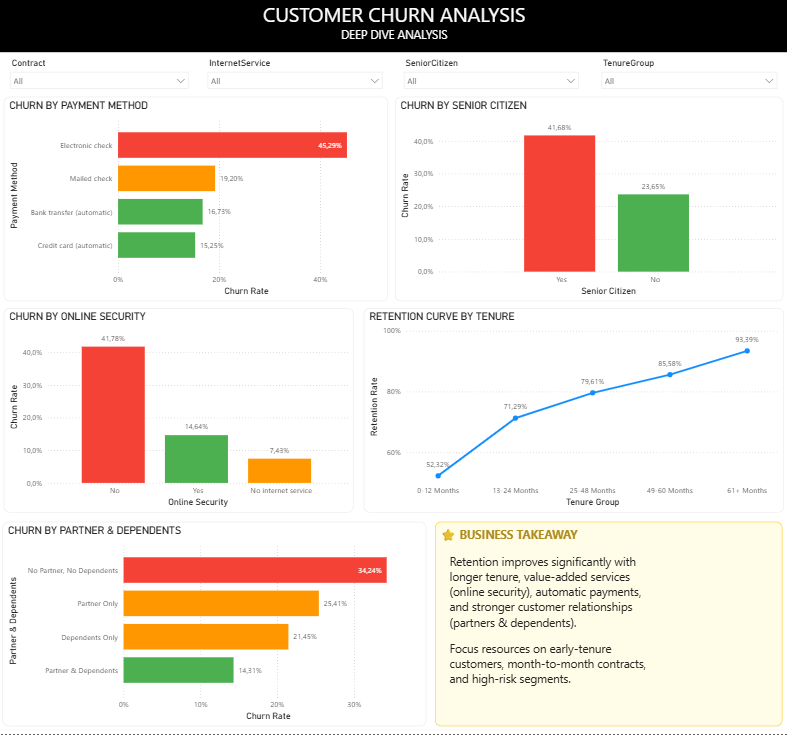

# 🔄 Customer Retention & Churn Analysis

## 📌 Overview
This project was completed as part of the Future Interns Data Science & Analytics Internship.

The goal was to analyze customer subscription data to understand the factors influencing customer churn and retention. Through exploratory data analysis (EDA) and business intelligence reporting, the project identifies key churn drivers, retention patterns, and customer lifetime trends.

Insights from the analysis are presented through an interactive Power BI dashboard, providing actionable recommendations that can help subscription-based businesses improve customer retention and reduce churn.

The project utilized Python for data cleaning, preprocessing, and exploratory data analysis, while Power BI was used to develop interactive dashboards and communicate business insights.

## 🛠️ Tools & Technologies
- 🐍 **Python** — Data cleaning, exploration and analysis
  - 🧮 Pandas — Data manipulation and aggregation
  - 📊 Matplotlib — Data visualization
  - 📈 Seaborn — Statistical visualizations
- 📊 **Power BI** — Interactive dashboard development
- 📓 **Jupyter Notebook** — Analysis environment
- 🐙 **GitHub** — Version control and project documentation

## 📂 Dataset
- 📦 **Name:** Telco Customer Churn Dataset
- 🌐 **Source:** Kaggle
- 📊 **Records:** 7,032 rows × 21 columns (after cleaning)
- 🧾 **Features:** Customer demographics, services subscribed, contract type, payment method, tenure and churn status
- 🔗 **Dataset Link:** https://www.kaggle.com/datasets/blastchar/telco-customer-churn

## 📁 Project Structure
```text
FUTURE_DS_02/
│
├── data/
│   ├── WA_Fn-UseC_-Telco-Customer-Churn.csv    # Original dataset
│   └── telco_churn_cleaned.csv                  # Cleaned dataset
│
├── notebooks/
│   └── Customer_Churn_Analysis.ipynb            # Data cleaning, EDA, and insights
│
├── dashboard/
│   └── Customer_Churn_Dashboard.pbix            # Power BI dashboard
│
├── images/
│   ├── page1_executive_overview.png             # Executive Overview Dashboard
│   └── page2_deep_dive_analysis.png             # Deep Dive Analysis Dashboard
│
└── README.md
```

## 📊 Key Findings
- 📉 Overall churn rate is **26.58%** (1,869 out of 7,032 customers), above the industry average.
- 📋 **Month-to-month customers churn at 42.7%**, compared to only 2.8% for two-year contract customers — contract type is the strongest churn predictor.
- ⏱️ **47.7% of customers churn within their first 12 months** — the early tenure period is the highest risk window.
- 🌐 **Fiber optic customers churn at 41.9%** despite paying premium prices, suggesting a value perception issue.
- 💳 **Electronic check customers churn at 45.3%** — the highest of all payment methods. Automatic payment customers churn at 15-16%.
- 🔒 Customers **without online security churn at 41.8%**, compared to only 14.6% for those with it — online security is a key retention driver.
- 👴 **Senior citizens churn at 41.7%** compared to 23.7% for non-seniors — a vulnerable segment requiring targeted support.
- 👨‍👩‍👧 Customers **without partners or dependents exhibit higher churn rates** than those with family connections.
- 📈 **Retention improves consistently with tenure** — customers with 61+ months show a 93.4% retention rate.

## 📊 Dashboard
The Power BI dashboard consists of two pages:

### 📌 Page 1 — Executive Overview
An overview designed for business owners and executives, featuring KPI cards, 
churn by contract type, churn by tenure group, churn by internet service, 
average monthly charges by churn status, and key insights and recommendations.



### 🔍 Page 2 — Deep Dive Analysis
A detailed analytical view covering churn by payment method, senior citizen status, 
online security, retention curve by tenure, and churn by partner and dependents.



## ▶️ How to Run the Notebook
1. 📥 Clone this repository or download the project files locally
2. 🐍 Ensure Python is installed, along with the required libraries:
   - `pandas`
   - `matplotlib`
   - `seaborn`
3. 📓 Open `notebooks/Customer_Churn_Analysis.ipynb` in Jupyter Notebook
4. ▶️ Run all cells sequentially from top to bottom
5. 💾 The cleaned dataset will be automatically exported to `data/telco_churn_cleaned.csv`
6. 📊 Open the Power BI dashboard file in Power BI Desktop: `dashboard/Customer_Churn_Dashboard.pbix`

## 👤 Author
**Ngcebo Enock Mntungwa**  
📊 Data Science & Analytics Intern — Future Interns  
🔗 [LinkedIn](https://www.linkedin.com/in/enock-mntungwa-803534227)  
🐙 [GitHub](https://github.com/John31615/)
